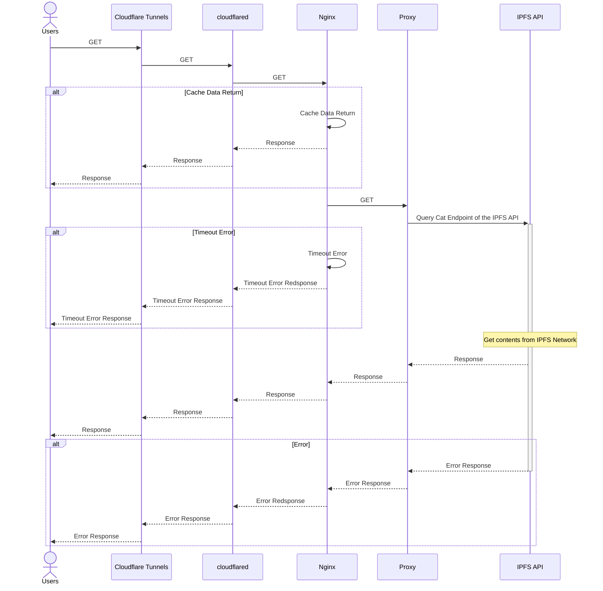

## deno-ipfs-gateway

### Configuration Chart
```mermaid
%% { init: { 'flowchart': { 'curve': 'liner' } } }%%
flowchart TD
subgraph CloudflareGroup["🌥 Cloudflare"]
  subgraph ZeroTrustGroup["Zero Trust"]
    TU1{{"🚇 Tunnels"}}
    AC1{{"🔐 Access"}}
    TU2{{"🚇 Tunnels"}}
  end
end

subgraph OCIGroup["🌥 Oracle Cloud Infrastracrure"]
  subgraph OCICompute["💻 Bare Metal Compute"]
    subgraph DockerGroup["🐳 Docker Compose"]
      subgraph MainServiceGroup["Main Services"]
        subgraph Nginx["📦 Nginx"]
          NG1[["Proxy<br>Port: 80"]] <-.-> |proxy_cache| NG2[["Cache"]]
        end
        DO1["📦 Cloudflared"] --> NG1
        DO1 -.-> |service_healthy| Nginx
        subgraph DenoIPFSProxyGroup["Deno IPFS Proxy Services"]
          direction TB
          subgraph DenoIPFSProxy01["📦 Deno IPFS Proxy"]
            direction TB
            DI011[["Proxy<br>Port: 8000"]] --> |cat| DI012[["IPFS<br>Port: 4001"]]
          end
          subgraph DenoIPFSProxy02["📦 Deno IPFS Proxy"]
            direction TB
            DI021[["Proxy<br>Port: 8000"]] --> |cat| DI022[["IPFS<br>Port: 4001"]]
          end
          subgraph DenoIPFSProxy03["📦 Deno IPFS Proxy"]
            direction TB
            DI031[["Proxy<br>Port: 8000"]] --> |cat| DI032[["IPFS<br>Port: 4001"]]
          end
          subgraph DenoIPFSProxy04["📦 Deno IPFS Proxy"]
            direction TB
            DI041[["Proxy<br>Port: 8000"]] --> |cat| DI042[["IPFS<br>Port: 4001"]]
          end
          subgraph DenoIPFSProxy05["📦 Deno IPFS Proxy"]
            direction TB
            DI051[["Proxy<br>Port: 8000"]] --> |cat| DI052[["IPFS<br>Port: 4001"]]
          end
        end
        NG1 --> |upstream| DenoIPFSProxyGroup
        Nginx -.-> |service_healthy| DenoIPFSProxyGroup
      end
      subgraph MoniterGroup["Moniter Services"]
        direction TB
        DO2["📦 Autoheal"]
        DO3["📦 Cloudflared"] --> DO4["📦 Netdata<br>Port: 19999"]
        DO2 -.-> |autoheal=true| DO4
        DO2 -.-> |autoheal=true| DO3
      end
      DO2 -.-> |autoheal=true| MainServiceGroup
    end
    Nginx <-.-> |/etc/nginx/conf.d| FS1[/"."/]
    DO2 <-.-> FS2[/"/var/run/docker.sock"/]
    DO4 -.-> FS2
    DO4 -.-> |/host/sys| FS3[/"/sys"/]
    DO4 -.-> |/host/proc| FS4[/"/proc"/]
    DO4 -.-> |/host/etc/passwd| FS5[/"/etc/passwd"/]
    DO4 -.-> |/host/etc/group| FS6[/"/etc/group"/]
    DO4 -.-> |/host/etc/os-release| FS7[/"/etc/os-release"/]
    DO4 -.-> |/host/var/log/| FS8[/"/var/log"/]
  end
end

OU2["👤 Users"] --> TU1 ---> DO1
OU1["👤 Admin"] --> AC1 --> TU2 --> DO3

style CloudflareGroup fill-opacity:0,stroke:#ff6d37,stroke-width:5px
style ZeroTrustGroup fill-opacity:0,stroke:#ff6d37,stroke-width:3px
style OCIGroup fill-opacity:0,stroke:#53565a,stroke-width:5px
style OCICompute fill-opacity:0,stroke:#53565a,stroke-width:4px
style DockerGroup fill-opacity:0,stroke:#00f,stroke-dasharray:5 5,stroke-width:3px
style MainServiceGroup fill-opacity:0,stroke:#ff4500,stroke-dasharray:5 5,stroke-width:2px
style MoniterGroup fill-opacity:0,stroke:#228b22,stroke-dasharray:5 5,stroke-width:2px
style DenoIPFSProxyGroup fill-opacity:0,stroke:#66cdaa,stroke-dasharray:5 5
```

### Sequence Diagrams
